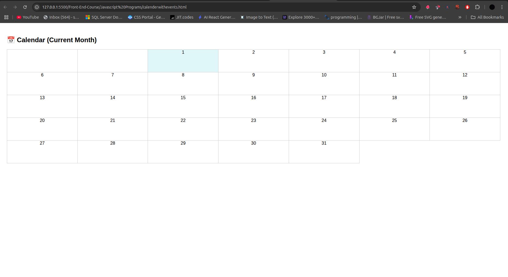
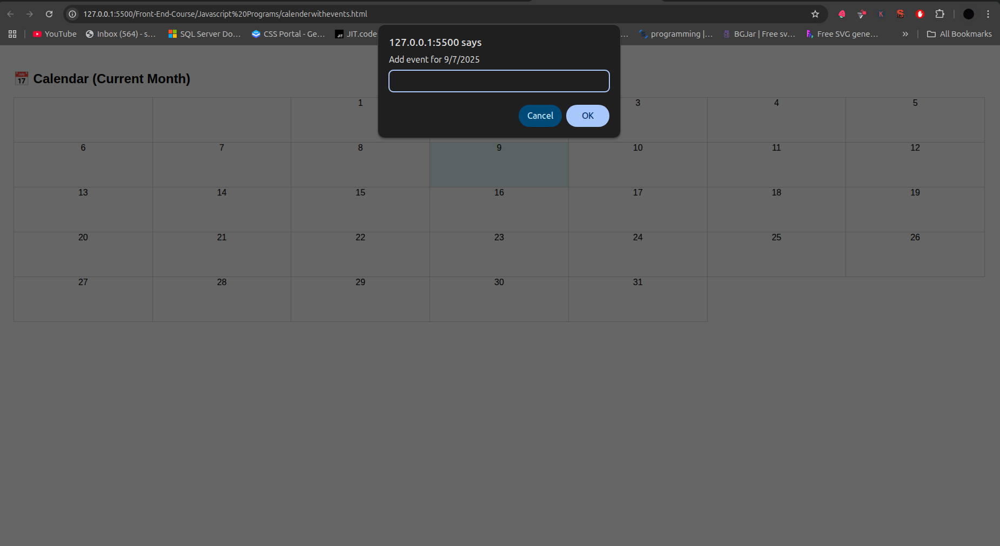

# 📅 Simple Calendar with Events

A lightweight HTML/JavaScript calendar that displays the current month and lets users add events by clicking on dates.

## Preview
 *(placeholder image)*
 *(placeholder image)*
 *(placeholder image)*

## Features
- Displays the current month in a clean table layout
- Click on any date to add an event
- Events appear below the calendar
- Mobile-friendly design

## Code (`calendar.html`)
```html
<!DOCTYPE html>
<html lang="en">
<head>
  <meta charset="UTF-8" />
  <title>Simple Calendar with Events</title>
  <style>
    body { font-family: sans-serif; padding: 20px; }
    table { width: 100%; border-collapse: collapse; }
    td {
      width: 14.28%; height: 80px; text-align: center;
      border: 1px solid #ccc; vertical-align: top;
      cursor: pointer;
    }
    td:hover { background: #e0f7fa; }  /* Light blue hover effect */
    #eventBox { margin-top: 15px; }
  </style>
</head>
<body>
  <h2>📅 Calendar (Current Month)</h2>
  <table id="calendar"></table>
  <div id="eventBox"></div>

  <script>
    // Get current date and initialize calendar
    const now = new Date();
    const year = now.getFullYear();
    const month = now.getMonth();

    const calendar = document.getElementById('calendar');
    const daysInMonth = new Date(year, month + 1, 0).getDate();  // Last day of month
    const startDay = new Date(year, month, 1).getDay();          // First weekday (0-6)

    // Generate calendar grid
    let html = '<tr>';
    for (let i = 0; i < startDay; i++) html += '<td></td>';  // Empty cells for days before 1st

    for (let day = 1; day <= daysInMonth; day++) {
      if ((startDay + day - 1) % 7 === 0) html += '</tr><tr>';  // New row every 7 days
      html += `<td onclick="addEvent(${day})">${day}</td>`;     // Clickable date cell
    }

    calendar.innerHTML = html + '</tr>';

    // Event handler
    function addEvent(day) {
      const event = prompt(`Add event for ${day}/${month + 1}/${year}`);
      if (event) {
        document.getElementById('eventBox').innerHTML += 
          `<p><strong>${day}/${month + 1}</strong>: ${event}</p>`;
      }
    }
  </script>
</body>
</html>
```

# 📅 Calendar Code Walkthrough

## 1. HTML Structure
```html
<!DOCTYPE html>
<html lang="en">
<head>
  <meta charset="UTF-8">
  <title>Simple Calendar with Events</title>
  <!-- CSS styles -->
</head>
<body>
  <h2>📅 Calendar (Current Month)</h2>
  <table id="calendar"></table>  <!-- Calendar grid will be injected here -->
  <div id="eventBox"></div>     <!-- Events will appear here -->
  <!-- JavaScript -->
</body>
</html>
```

## 2. CSS Styling
```css
body { font-family: sans-serif; padding: 20px; }
table { width: 100%; border-collapse: collapse; }
td {
  width: 14.28%; /* Equal width for 7 days (100%/7) */
  height: 80px;
  border: 1px solid #ccc;
  cursor: pointer; /* Shows clickable hand icon */
}
td:hover { background: #e0f7fa; } /* Hover effect */
```

## 3. JavaScript Logic

### Step 1: Initialize Date Variables
```javascript
const now = new Date();                     // Current date object
const year = now.getFullYear();             // Current year (e.g., 2023)
const month = now.getMonth();               // Current month (0-11)
```

### Step 2: Calculate Calendar Parameters
```javascript
const daysInMonth = new Date(year, month + 1, 0).getDate();
// ^ Gets last day of month (e.g., 31 for January)

const startDay = new Date(year, month, 1).getDay();
// ^ Gets weekday (0-6) of 1st day of month (0=Sunday)
```

### Step 3: Generate Calendar Grid
```javascript
let html = '<tr>';

// 1. Add empty cells for days before the 1st
for (let i = 0; i < startDay; i++) {
  html += '<td></td>';
}

// 2. Add date cells
for (let day = 1; day <= daysInMonth; day++) {
  // Start new row every 7 days
  if ((startDay + day - 1) % 7 === 0) {
    html += '</tr><tr>';
  }
  // Clickable date cell with event handler
  html += `<td onclick="addEvent(${day})">${day}</td>`;
}

calendar.innerHTML = html + '</tr>';
```

### Step 4: Event Handling
```javascript
function addEvent(day) {
  // 1. Show input prompt
  const event = prompt(`Add event for ${day}/${month + 1}/${year}`);
  
  // 2. If user entered something
  if (event) {
    // 3. Append event to the event box
    document.getElementById('eventBox').innerHTML += 
      `<p><strong>${day}/${month + 1}</strong>: ${event}</p>`;
  }
}
```

## Key Algorithms Explained

### Date Calculation
```javascript
new Date(year, month + 1, 0).getDate()
```
- Creates a date object for day 0 of the NEXT month
- Day 0 = last day of previous month → gives days in current month

### Grid Positioning
```javascript
(startDay + day - 1) % 7 === 0
```
- `startDay`: Weekday offset of 1st day
- `day`: Current date (1-31)
- Formula determines when to break to a new row (every 7 cells)

## Visual Flowchart
1. Initialize → 2. Calculate grid → 3. Render cells → 4. Handle clicks
```mermaid
graph TD
    A[Start] --> B[Get current date]
    B --> C[Calculate days in month]
    C --> D[Generate empty cells]
    D --> E[Fill date cells]
    E --> F[Wait for click]
    F --> G{User clicks date}
    G --> H[Show prompt]
    H --> I[Add event to DOM]
```

## Common Questions
**Q:** Why `month + 1` in days calculation?  
**A:** JavaScript months are 0-indexed, but passing month+1 with day=0 rolls back to last day of current month.

**Q:** How does the 7-day row break work?  
**A:** The formula `(startDay + day - 1) % 7` tracks position in weekly cycle. When result is 0, it's time for a new row.

## Limitations
- Events disappear on page refresh (no persistence)
- No date navigation (only current month)

## Possible Enhancements
```javascript
// Example: Add localStorage to save events
localStorage.setItem('events', JSON.stringify(events));
```

---